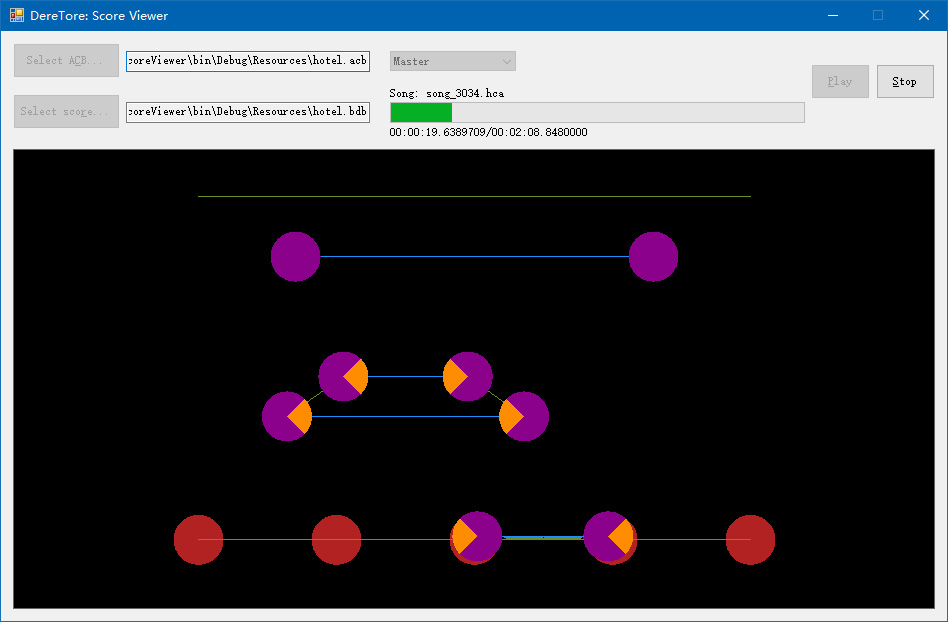

# DereTore.Application.ScoreViewer

A simple score viewer for CGSS live music.

An example of [Hotel Moonside](http://www.project-imas.com/wiki/Hotel_Moonside), showing the most famous 'X' swiping notes:

Test files can be found in [Resources](/Resources). Their copyrights belong to [BandaiNamco Entertainment Inc.](http://bandainamcoent.co.jp/).
