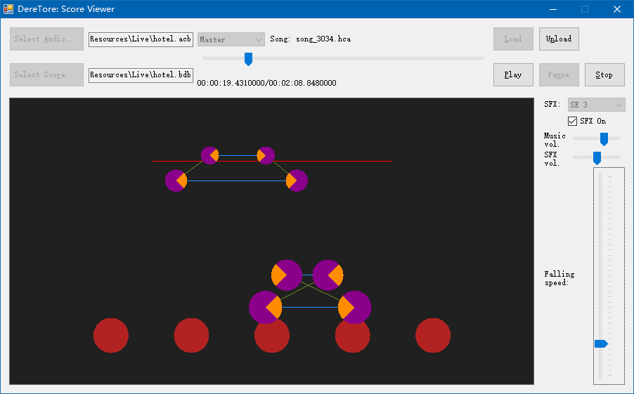

# DereTore Score Viewer

A simple score viewer for CGSS live music.

An example of [Hotel Moonside](http://www.project-imas.com/wiki/Hotel_Moonside), showing the most famous 'X' swiping notes:

Test files can be found in [Resources](Resources). Their copyrights belong to [BandaiNamco Entertainment Inc.](http://bandainamcoent.co.jp/).

## Features

- WYSIWYG editing
- unified time basis, using live music audio stream as the standard[1]
- direct reading and writing of data files extracted from CGSS

[1] CGSS seems to use 2 bases. The live music is played as a background task, and the
score timing is based on a timer built on elapsed time between frames. I was fortunate to
encounter a serious performance problem on my phone once. At that time, the live music
continued but the score got frozen for several times. In the end there are about 2 seconds
of delay between the music and the score, and that's why I made the elapsed time guess.

## Prerequisities

- Microsoft .NET Framework 4.0
- Windows Vista or above *(usage of WAS API)*
